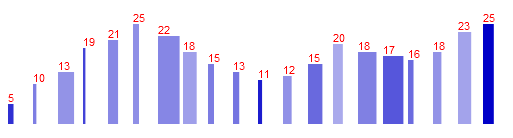

Visualization Programming using d3
==============

3 simple exercises of varying degrees of difficulty done for an Information Visualization course. The working exercises are available <a href="http://kaizora.github.io/d3-exercises/">here</a>. Instructions of the exercise are below.

I encourage attempting these exercises without looking at the source code, but instead, read Scott Murray's book, “Interactive Data Visualization for the Web”, and use his <a href="https://github.com/alignedleft/d3-book">examples</a> as reference.

Exercise 1: 
==============
Use the following file as the starting point for your Ex1: https://github.com/alignedleft/d3-book/blob/master/chapter_06/21_making_a_bar_chart_aligned.html

Make following modifications: 

* Use data set with three data variables:
var dataset = [ [5, 23, 75], [10, 14, 34], [13, 67, 23], [19, 10, 65], [21, 42, 29], [25, 25, 25], [22, 90, 30], [18, 57, 17], [15, 25, 35], [13, 26, 39], [11, 17, 85], [12, 36, 24], [15, 60, 45], [20, 41, 11], [18, 77, 33], [17, 85, 55], [16, 23, 44], [18, 35, 23], [23, 55, 15], [25, 45, 100] ];

* First data variable is used for height of bar.

* Second data variable is used to scale width of bar (need to scale how the width is computed in the example code by the 2nd variable divided by 100). In short: the width is proportional to value of the 2nd variable, which you can assume is a value between 1 and 100.

* Third variable is used to control fill-opacity of bar, where the fill-opacity can not be less than 0.25 and the 3rd variable scales 0.75 by being divided by 100).

* The color is rgb (0, 0, 200).

* The text label has to be shown in red and needs to be placed at the top of the bar, be left-aligned and fully visible (to achieve full visibility, add an area to the chart at the top that has a height of 20 pixels).

* The final chart needs to look like this:

Exercise 2: 
==============
Use your Ex1 as a starting point for Ex2:

* Use data set with three data variables:
var dataset = [ [5, 23, 75], [10, 14, 34], [13, 67, 23], [19, 10, 65], [21, 42, 29], [25, 25, 25], [22, 90, 30], [18, 57, 17], [15, 25, 35], [13, 26, 39], [11, 17, 85], [12, 36, 24], [15, 60, 45], [20, 41, 11], [18, 77, 33], [17, 85, 55], [16, 23, 44], [18, 35, 23], [23, 55, 15], [25, 45, 100] ];

* As in Ex1, first data variable is used for height of bar. Second data variable is used to scale width of bar. Third variable is used to control fill-opacity of bar.

* Use width = 500 and height = 250 for the bar chart.

Make following modifications and enhancements to Ex1: 

* Add ordinal xScale and linear yScale (similar to  bar chart example in Chapter 9, but keep in mind that we have multidimensional dataset) and update how bar chart is created.
Make sure to use approach described on page 117 in Chapter 7 for computing max for 1st variable.

* Add hover effect for bar so that fill color is changed to red using CSS rule (as covered in Chapter 10 example).

* Add sort capabilities when clicking on bar so that user can sequentially sort by the 1st, 2nd and 3rd variable, respectively (hint: use  Modulus (division remainder) operator) and make sure that text label shows value of variable currently used to sort the bar chart.

* When using ascending(a, b), keep in mind that a and b are arrays and you need to specify which variable to use in the sort operation.

* To be able to "cycle through" the different variables when successively clicking on one of the bars use the Modulus (division remainder) operator in JavaScript to specify which variable to sort by.

* Add scaling capabilities so that height of the bars is scaled by 1/3, 2/3 and 1, respectively, by successively clicking on a paragraph above the chart.

* Modulus (division remainder) operator in JavaScript could be useful to employ.

* The text label has to be shown in red and needs to be placed at the top of the bar, be left-aligned and fully visible as well as maintain its position with respect to the top of a bar as the bar chart is sorted and/or scaled.

* Add transition effects when the user performs a sorting and/or scaling operation.

* Use a delay function for all transitions.

Final Chart needs to look and behave like 'Exercise_02_text.html' (do not look at code if attempting this)

Exercise 3: 
==============
Use what you learned in Ex2.

Create a data set using public sources, such as data.gov, for all the US states that consists of three data variables.

Create map display for the US states that visualizes three data variables:

* Use the shape files for the states to create a "area map" or "choropleth map" where a state's area shape is colored based on the value of the 1st data variable (select color and vary saturation or opacity value);

* Find the geo-code of the center of a state's area shape or find the state capitol's geo-code, whichever is easier.
Create "size map" where the size of the circle is proportional to the value of 2nd variable and position it at the center of a state's area shape or at the state's capitol.

 * Create two proportionally sized circles at a given location so that the larger white or black circle sits below the 2nd smaller circle: we want to create white or black surround (or border effect) so that there is sufficient contrast between colored area of the smaller circle and "surround" circle and the color of state's area.

 * The color opacity of the smaller circle is based on the value of the third variable.

* Add "swapping capability" of the data variables so that clicking in p tag or a button causes the the state's area to be colored based on the 2nd variable and the size of the bubble and its color is based on the 3rd and 1st variables, respectively. On the next click, the 3rd variable is used for state's area color etc. In short, clicking on the p tag or button let's the user "cycle through" the variables used for area color, bubble size and color.

* Add transition effects when the user performs a swapping operation.

* Create a bar chart, as in Ex2, that displays the three data variables (and is placed below the map):

* Add ordinal xScale and linear yScale

* Add x and y axes (optional)

* Add hover effect for bar so that fill color is changed to red using CSS rule

* Add sort capabilities when clicking on bar so that user can sequentially sort by the 1st, 2nd and 3rd variable, respectively and make sure that text label shows value of variable currently used to sort the bar chart.

* The text label has to be shown in red and needs to be placed at the top of the bar, be left-aligned and fully visible as well as maintain its position with respect to the top of a bar as the bar chart is sorted.

* Add transition effects when the user performs a sorting operation.

In my code, I used this dataset: http://nces.ed.gov/ccd/tables/2009305_04.asp to visualize the  Pre-K-12 Total Student Membership, Total Staff, and Student/Teacher Ratio in the US (school year 2006-2007). I also added a few extra touches to the map such as using tipsy to bring up the state's name in tooltips on hover over a state and swapping the labels when the "Swap Me!" button is clicked.

Lastly, I was told that the data showing up on top of the bars in the bar chart do not need to be completely visible for the purpose of this exercise.
